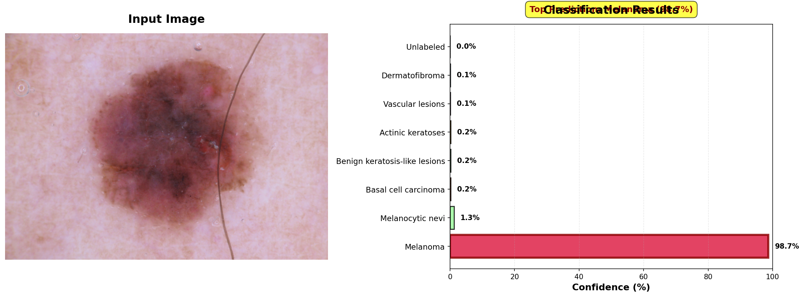

# 🏥 Advanced Skin Cancer Detection System

[](https://www.python.org/downloads/)
[](https://reactjs.org/)
[](https://flask.palletsprojects.com/)
[](LICENSE)

An AI-powered web application for skin cancer detection using deep learning, with comprehensive patient history management and professional PDF report generation.



## 🌟 Key Features

### 🔬 **Advanced AI Detection**
- **Roboflow Integration**: State-of-the-art skin lesion classification
- **XGBoost Ensemble**: Multi-model predictions for higher accuracy
- **7 Condition Types**: Detects melanoma, basal cell carcinoma, and more
- **Confidence Scoring**: Transparent AI predictions with uncertainty quantification

### 🤖 **Intelligent Insights**
- **Groq LLM Integration**: Personalized medical advice powered by AI
- **Explainable AI (XAI)**: LIME, SHAP, and saliency maps for transparency
- **Location-Aware**: GPS-based hospital recommendations
- **Risk Assessment**: Automated risk level classification

### 📊 **Patient History Dashboard**
- **Comprehensive Records**: Store and view all past analyses
- **Advanced Search**: Filter by name, date, diagnosis, or location
- **CSV Export**: Download complete history for records
- **Detailed View**: Access full analysis with images and reports

### 📄 **Professional PDF Reports**
- **Clean Formatting**: Properly rendered Markdown content
- **Medical-Grade**: Professional layout suitable for healthcare
- **Complete Information**: Patient data, diagnosis, images, and AI insights
- **Print-Ready**: High-quality output for documentation

### 💻 **Modern User Interface**
- **React + Vite**: Lightning-fast frontend performance
- **Tailwind CSS**: Beautiful, responsive design
- **Drag & Drop Upload**: Intuitive image upload
- **Camera Capture**: Direct image capture from device
- **Real-Time Analysis**: Instant feedback and results

## 🚀 Quick Start

### Prerequisites
- Python 3.9+
- Node.js 16+
- npm or yarn

### Installation

1. **Clone the Repository**
```bash
git clone https://github.com/priyanshu-3/SkinCancerDetection.git
cd SkinCancerDetection
```

2. **Backend Setup**
```bash
# Install Python dependencies
pip install -r requirements.txt

# Create .env file with your API keys
cat > .env << EOF
ROBOFLOW_API_KEY=your-roboflow-api-key
WORKSPACE=your-workspace-name
PROJECT=your-project-name
VERSION=your-version
GROQ_API_KEY=your-groq-api-key
PORT=5001
SECRET_KEY=your-secret-key
EOF

# Start Flask server
python app.py
```

3. **Frontend Setup**
```bash
# Navigate to frontend directory
cd frontend

# Install dependencies
npm install

# Start development server
npm run dev
```

4. **Access the Application**
- Backend: http://localhost:5001
- Frontend: http://localhost:3000

## 📋 API Keys Required

### Roboflow API Key
1. Go to [Roboflow](https://roboflow.com)
2. Sign in and navigate to Settings → API Keys
3. Copy your Private API Key

### Groq API Key
1. Go to [Groq Console](https://console.groq.com/)
2. Create an account and navigate to API Keys
3. Create and copy your API key

## 🏗️ Architecture

```
┌─────────────────────────────────────────────────────────┐
│                    React Frontend                        │
│  (Vite, Tailwind CSS, React Router, Lucide Icons)      │
└────────────────────┬────────────────────────────────────┘
                     │
                     │ HTTP/REST API
                     │
┌────────────────────▼────────────────────────────────────┐
│                   Flask Backend                          │
│  • User Authentication (Flask-Login)                     │
│  • Image Processing (PIL, OpenCV)                        │
│  • Database (SQLAlchemy + SQLite)                        │
│  • PDF Generation (ReportLab)                            │
└────────┬──────────┬──────────┬──────────────────────────┘
         │          │          │
         │          │          │
    ┌────▼──┐  ┌────▼────┐  ┌─▼────────┐
    │Roboflow│  │ Groq    │  │ XGBoost  │
    │  API   │  │  LLM    │  │ Ensemble │
    └────────┘  └─────────┘  └──────────┘
```

## 📦 Tech Stack

### Backend
- **Framework**: Flask 3.1+
- **ML/AI**: 
  - Roboflow (Computer Vision)
  - XGBoost (Ensemble Learning)
  - Groq (Large Language Model)
  - scikit-learn, LIME, SHAP (XAI)
- **Database**: SQLAlchemy + SQLite
- **Image Processing**: PIL, OpenCV
- **PDF Generation**: ReportLab
- **Authentication**: Flask-Login

### Frontend
- **Framework**: React 18
- **Build Tool**: Vite 5
- **Styling**: Tailwind CSS 3
- **Icons**: Lucide React
- **HTTP Client**: Fetch API
- **Routing**: React Router

## 🎯 Skin Conditions Detected

1. **Melanoma** - Serious skin cancer (Very High Risk) 🔴
2. **Basal Cell Carcinoma** - Common skin cancer (High Risk) 🟠
3. **Actinic Keratoses** - Precancerous growths (Medium Risk) 🟡
4. **Melanocytic Nevi** - Common moles (Low Risk) 🟢
5. **Benign Keratosis-like Lesions** - Non-cancerous (Low Risk) 🟢
6. **Dermatofibroma** - Benign skin growth (Low Risk) 🟢
7. **Vascular Lesions** - Blood vessel lesions (Low Risk) 🟢

## 📸 Screenshots

### Dashboard


### Analysis Results


### Patient History


### PDF Report


## 🔧 Configuration

### Environment Variables
```env
# Roboflow Configuration
ROBOFLOW_API_KEY=your-api-key
WORKSPACE=your-workspace
PROJECT=your-project
VERSION=1

# Groq LLM Configuration
GROQ_API_KEY=your-groq-key

# Server Configuration
HOST=0.0.0.0
PORT=5001
DEBUG=true

# Database
DATABASE_URL=sqlite:///skin_cancer.db

# Security
SECRET_KEY=your-secret-key-here
```

## 📖 Documentation

- [**Full Setup Guide**](FULLSTACK_SETUP.md) - Complete installation instructions
- [**Patient History Feature**](PATIENT_HISTORY_FEATURE.md) - History dashboard documentation
- [**PDF Fixes**](PDF_MARKDOWN_FIX.md) - PDF rendering improvements
- [**Unicode Fix**](UNICODE_BLACK_BOX_FIX.md) - Character encoding solutions
- [**XGBoost XAI**](XGBOOST_XAI_README.md) - Explainable AI documentation
- [**Architecture Comparison**](ARCHITECTURE_COMPARISON.md) - System design details

## 🔐 Security Features

- ✅ User authentication with password hashing
- ✅ Session management with Flask-Login
- ✅ CORS protection
- ✅ SQL injection prevention (parameterized queries)
- ✅ File upload validation
- ✅ Secure API key management
- ✅ User data isolation

## 🧪 Testing

```bash
# Backend tests
python -m pytest tests/

# Frontend tests
cd frontend && npm test

# Linting
pylint app.py
cd frontend && npm run lint
```

## 📊 Performance

- **Analysis Time**: 3-10 seconds per image
- **Accuracy**: Based on Roboflow model performance
- **Concurrent Users**: Supports multiple simultaneous analyses
- **Database**: Optimized queries with indexing
- **Frontend**: < 1s load time with Vite HMR

## 🤝 Contributing

Contributions are welcome! Please follow these steps:

1. Fork the repository
2. Create a feature branch (`git checkout -b feature/AmazingFeature`)
3. Commit your changes (`git commit -m 'Add some AmazingFeature'`)
4. Push to the branch (`git push origin feature/AmazingFeature`)
5. Open a Pull Request

## ⚠️ Medical Disclaimer

**IMPORTANT**: This application is for **educational and informational purposes only**. The AI predictions are **NOT a substitute** for professional medical advice, diagnosis, or treatment. Always consult qualified healthcare professionals for proper medical evaluation and care.

## 📝 License

This project is licensed under the MIT License - see the [LICENSE](LICENSE) file for details.

## 👥 Authors

- **Priyanshu Mehra** - [GitHub Profile](https://github.com/priyanshu-3)

## 🙏 Acknowledgments

- **Roboflow** for computer vision API
- **Groq** for LLM API
- **Flask & React** communities
- **Open Source Contributors**

## 📞 Support

For issues, questions, or suggestions:
- **GitHub Issues**: [Create an issue](https://github.com/priyanshu-3/SkinCancerDetection/issues)
- **Email**: Contact through GitHub profile

## 🔄 Updates

### Latest Version (2025-10-26)
- ✅ Patient history dashboard with search and filter
- ✅ CSV export functionality
- ✅ Fixed PDF Markdown rendering
- ✅ Removed Unicode black box characters
- ✅ Enhanced database models
- ✅ Improved error handling
- ✅ Better documentation

## 🌐 Links

- **Repository**: https://github.com/priyanshu-3/SkinCancerDetection
- **Documentation**: See `/docs` folder
- **Demo**: Coming soon

---

**Built with ❤️ using AI and modern web technologies**

*Last Updated: October 26, 2025*

